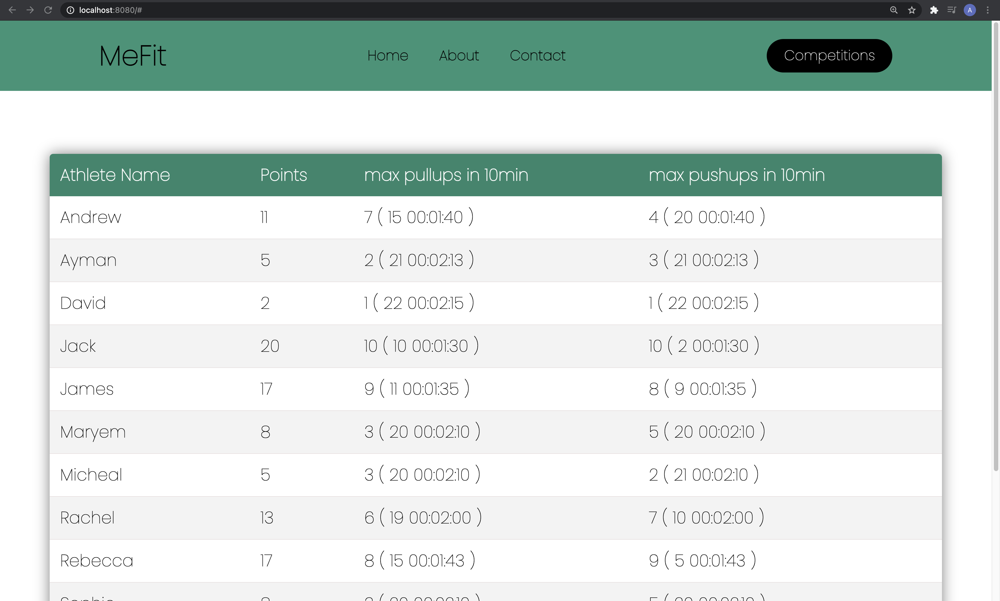
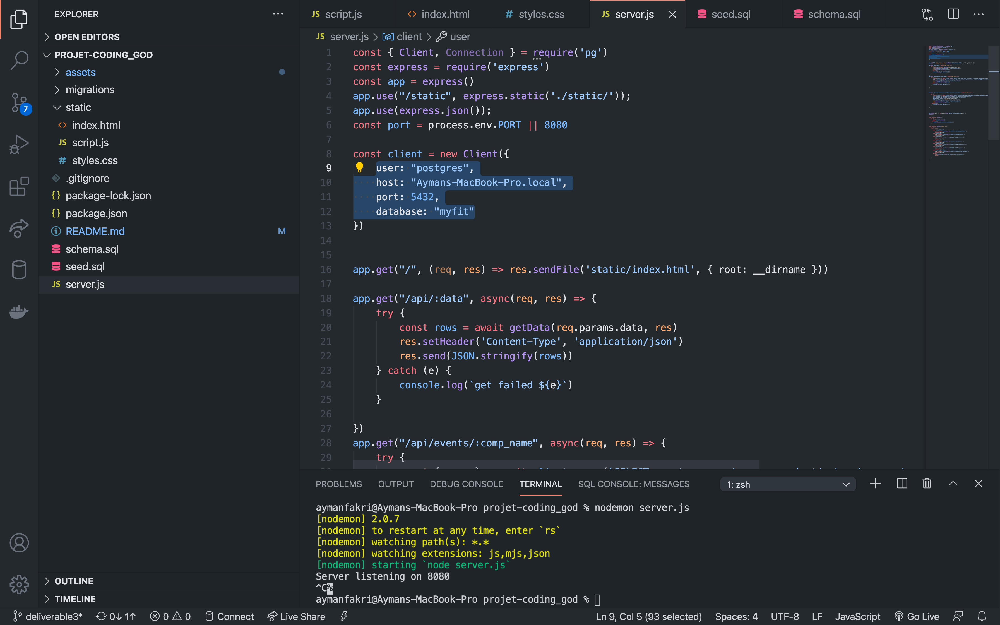
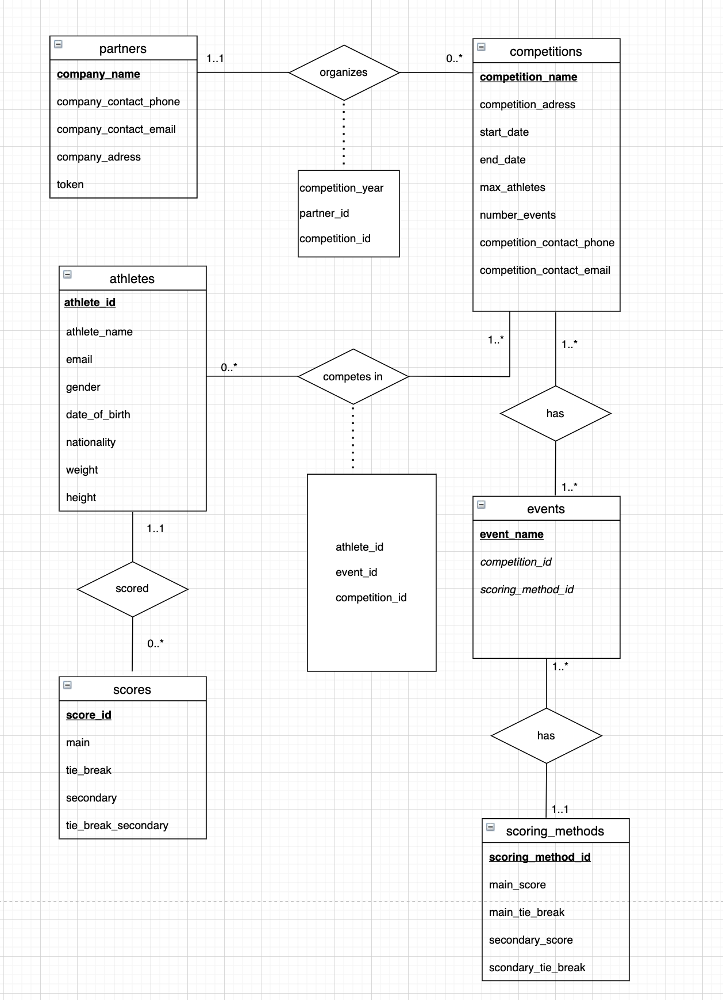
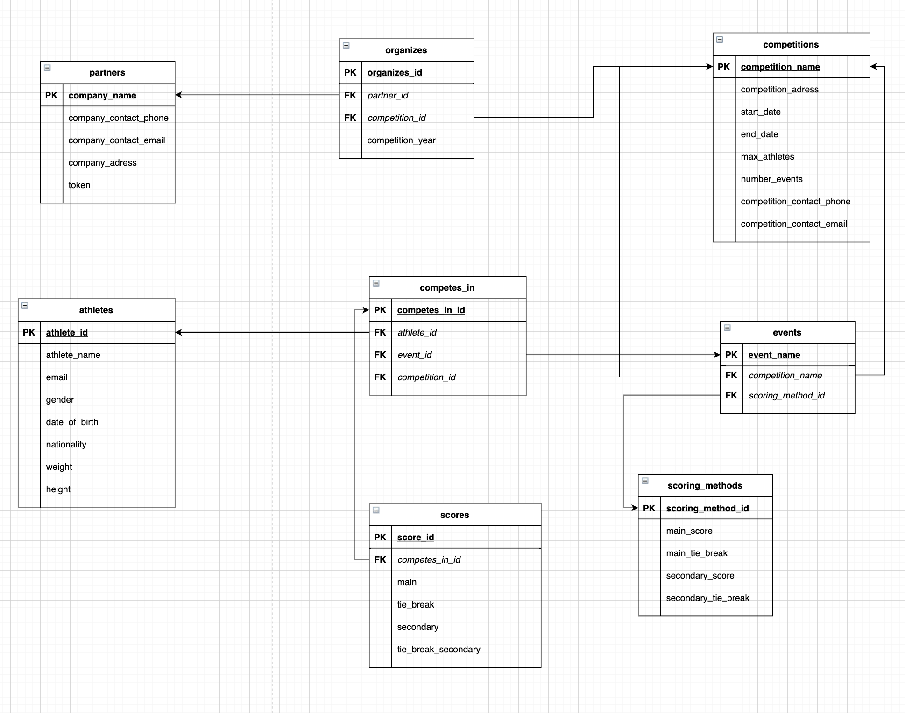
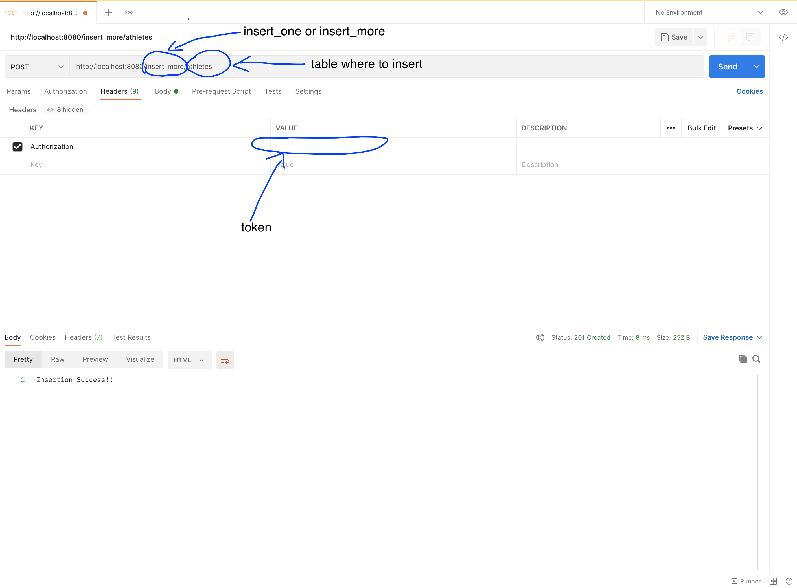

# University Project


This project was made using NodeJS, Express.

Node provided the utils to connect to the postgres database, while express was the framework used to serve the data onto the webpage. The leader board was generated with javascript and css for the styling. Here is the application once you run it. 

You can sort by clicking on the column header of your choice. You can change the leaderboard to another competition by clicking on the button competitions and choosing the on you desire.
The other buttons are going to be implemented in the next deliverable.


### Setting up the environment

#### Installing Nodejs
Very straight forward. Here is the link for the download [nodejs](https://nodejs.org/en/download/ )
#### Initialize enviroment
After properly setting up nodejs, go to the directory of the project files and run the following command.

```
npm install
```
This command will install all the required packages.

#### Client info

Change the the highlighted part of the code depending on your set-up. Note that you might need to add password if you have one in place.


#### Run the Server

Use the following command to run the server then go to [localhost](http://localhost:8080/) on your browser.
```
node server.js
```
Note that you can insert in that database and reload the page to see the data updated

### ER Diagram

This was created with [DrawIO](https://app.diagrams.net/). 

Note that the primary keys are in bold and are underlined.


.  

### Relational Diagram 

This was also created with [DrawIO](https://app.diagrams.net/). 

Note that the foreign key is in italic.



### Schema

The database was created using Postgres.  
We're going to use the schema.sql to create our database. To do so execute the following command. Make sure to replace "path" with the path of the seed.sql file in your system.Make sure that you dont have spaces in you path.
Or just copy and past it in postgres terminal.


```sql
\i path/schema.sql
```

### Insert

Here we're going to use the seed.sql to populate our data base. For that we're going to use the following command. Make sure to replace "path" with the path of the seed.sql file in your system.
Make sure that you dont have spaces in you path.
Or just copy and past it in postgres terminal.

```sql
\i path/seed.sql
```
### Assumptions MUST READ:


**All the athletes that are competing in a competition need to participate in all of the events in that competition. Thus when testing with data make sure that the same athletes are in each event of a competition.
Spaces must be replaced with "_",and "-" aren't allowed.**

### Inserting using api and postman:

Partners are able to insert athletes, competitions,events,etc... but not other partners.
Token keys are an attribute of each partner. There's two ways to make post requests. either inserting one element or an array of elements at once.





To insert one element the routing must include "insert_one" or "insert_more" to insert an array of values. The elements have to be JSON. Then the table where the insertiong will take place should be mentionned too.


